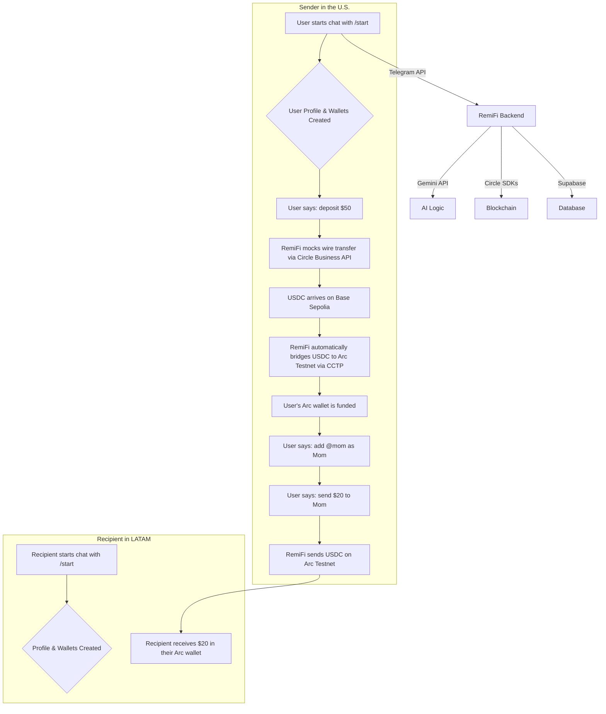

# RemiFi Bot 💸

**RemiFi** is an AI-powered agent designed to revolutionize cross-border payments. Built on Telegram, it empowers immigrants in the U.S. to seamlessly send digital dollars to their families back home in Latin America, completely abstracting away the complexities of blockchain technology.

Our mission is to provide a financial tool that feels as simple and intuitive as a modern fintech app, while leveraging the power and efficiency of web3 infrastructure. With RemiFi, sending money is as easy as sending a text message.

This project was developed for the **AI Agents on Arc with USDC Hackathon**.

## The Problem

Sending money internationally is often slow, expensive, and complicated. While blockchain and stablecoins like USDC offer a powerful alternative, the technical hurdles—managing wallet addresses, signing transactions, handling gas fees, and navigating different chains—make them inaccessible to the average person. Immigrants who could benefit most from this technology are often excluded due to its complexity.

## Our Solution: An AI Financial Friend

RemiFi solves this problem by providing a friendly, conversational AI agent on Telegram. Users interact with the bot in natural language, and RemiFi handles all the complex blockchain operations in the background.

**No seed phrases. No gas fees. No cryptic addresses. Just conversation.**

### Key Features

*   **🤖 Conversational AI Agent:** Powered by Google's Gemini, RemiFi understands natural language commands. Users can simply say:
    *   _""Check my balance.""_
    *   _""Add my mom, her username is @momusername.""_
    *   _""Send $20 to my mom.""_
    *   _""I want to deposit $50.""_
*   **🚀 Seamless Onboarding:** The user journey begins with a simple `/start` command. RemiFi automatically:
    1.  Creates a user profile in the database.
    2.  Provisions secure, developer-controlled wallets on both **Arc Testnet** and **Base Sepolia** using the Circle SDK.
    3.  Sets up a virtual bank account and recipient address for USD deposits using Circle's Business API.
*   **🫂 Human-Readable Contacts:** Users add recipients using their Telegram `@username`, not a long wallet address. RemiFi manages the mapping in the background.
*   **💵 Easy USD On-Ramp:** A fully automated flow simulates a USD bank deposit. RemiFi takes care of:
    1.  Mocking a wire transfer using the Circle Business (Sandbox) API.
    2.  Receiving the funds as USDC on the Base Sepolia network.
    3.  **Automatically bridging** the USDC to the user's primary wallet on the **Arc Testnet** via Circle's CCTP.
*   **👻 Complete Blockchain Abstraction:** All transactions are executed by the backend. The user never has to sign a transaction or worry about blockchain specifics.

## How It Works: Architecture & Tech Stack

RemiFi integrates a suite of modern technologies to create a seamless user experience.

*   **User Interface:** Telegram Bot
*   **Backend:** Node.js
*   **AI & Natural Language:** Google Gemini with Function Calling
*   **Blockchain Wallets:** Circle Developer-Controlled Wallets SDK
*   **USD On-Ramp:** Circle Business Account API (Sandbox)
*   **Cross-Chain Bridging:** Circle's Cross-Chain Transfer Protocol (CCTP)
*   **Database:** Supabase (PostgreSQL)
*   **Primary Network:** Arc Testnet
*   **Deposit & Bridge Network:** Base Sepolia

### User Flow Diagram



## Getting Started

Follow these steps to set up and run your own instance of RemiFi.

### Prerequisites

*   Node.js (v16 or higher)
*   A Telegram Bot Token from [@BotFather](https://t.me/BotFather)
*   A Supabase project for the database
*   A Google Gemini API Key
*   Circle API Keys:
    *   Developer-Controlled Wallets (W3S) API Key & Entity Secret
    *   Business Account Sandbox API Key

### Installation

1.  **Clone the repository:**
    ```bash
    git clone <your-repo-url>
    cd remifi
    ```

2.  **Install dependencies:**
    ```bash
    npm install
    ```

3.  **Set up your environment variables:**
    Copy the `.env.sample` file to a new file named `.env` and fill in your credentials.
    ```bash
    cp .env.sample .env
    ```
    Your `.env` file should look like this:
    ```env
    # Google Gemini
    GEMINI_API_KEY=your_gemini_api_key
    GEMINI_MODEL=gemini-1.5-flash

    # Telegram Bot
    TELEGRAM_BOT_TOKEN=your_telegram_bot_token

    # Supabase Database
    SUPABASE_URL=your_supabase_project_url
    SUPABASE_KEY=your_supabase_service_role_key

    # Circle W3S (Developer-Controlled Wallets)
    CIRCLE_API_KEY=your_w3s_api_key
    CIRCLE_ENTITY_SECRET=your_w3s_entity_secret

    # Circle Business Account (Sandbox)
    CIRCLE_SANDBOX_API_KEY=your_business_sandbox_api_key

    # Network Configuration (Defaults to Arc)
    NETWORK=ARC-TESTNET
    ```

4.  **Set up your Supabase Database:**
    Navigate to the "SQL Editor" in your Supabase project and run the following queries to create the necessary tables:
    ```sql
    -- Create the users table
    CREATE TABLE users (
      tg_id BIGINT PRIMARY KEY,
      tg_username TEXT UNIQUE,
      first_name TEXT,
      last_name TEXT,
      created_at TIMESTAMPTZ DEFAULT NOW(),
      circle_bank_account_id UUID,
      circle_recipient_address_id UUID
    );

    -- Create the wallets table
    CREATE TABLE wallets (
      id BIGINT PRIMARY KEY GENERATED ALWAYS AS IDENTITY,
      tg_id BIGINT NOT NULL REFERENCES users(tg_id),
      walletaddress TEXT NOT NULL,
      walletid TEXT NOT NULL,
      network TEXT NOT NULL,
      created_at TIMESTAMPTZ DEFAULT NOW()
    );

    -- Create the contacts table
    CREATE TABLE contacts (
      id BIGINT PRIMARY KEY GENERATED ALWAYS AS IDENTITY,
      user_tg_id BIGINT NOT NULL REFERENCES users(tg_id),
      nickname TEXT NOT NULL,
      contact_tg_id BIGINT NOT NULL REFERENCES users(tg_id),
      created_at TIMESTAMPTZ DEFAULT NOW(),
      UNIQUE(user_tg_id, nickname)
    );
    ```

5.  **Run the bot:**
    ```bash
    npm run dev
    ```

Your RemiFi agent is now live! Open Telegram and start a conversation with your bot.